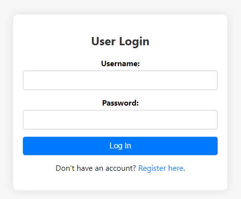
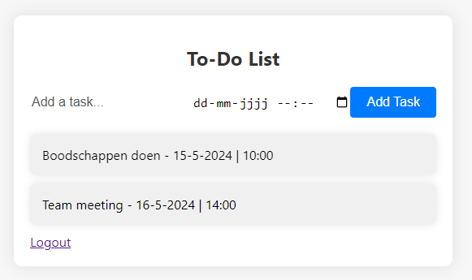

# To-Do List Application

Welcome to the To-Do List Application! This application allows users to register, log in, and manage their tasks efficiently. Each user has their own set of tasks, ensuring privacy and personalized task management.

## Features

- **User Registration**: Users can create an account to manage their tasks.
- **User Login**: Secure login system to access personalized tasks.
- **Task Management**: Add, view, and manage tasks with associated date and time.
- **Secure Data Handling**: User information and tasks are securely stored in JSON files.
- **Session Management**: Only logged-in users can access their tasks.
- **Stylish UI**: Modern and responsive design with smooth animations.

## Screenshots




## Getting Started

Follow these instructions to get a copy of the project up and running on your local machine for development and testing purposes.

### Prerequisites

- [XAMPP](https://www.apachefriends.org/index.html) or any other PHP development environment
- Web browser (e.g., Chrome, Firefox)

### Installation

1. Clone the repository to your local machine:
    ```sh
    git clone https://github.com/JHVI/todolist.git
    ```

2. Navigate to the project directory:
    ```sh
    cd todolist
    ```

3. Start your PHP server (e.g., XAMPP) and ensure it's pointing to the project directory.

4. Create a `.htaccess` file in the project directory with the following content to secure the JSON files:

    ```apache
    # Block access to JSON files
    <FilesMatch "\.json$">
        Order Deny,Allow
        Deny from all
    </FilesMatch>

    # Allow access to HTML, CSS, and JS files
    <FilesMatch "\.(html|css|js)$">
        Order Allow,Deny
        Allow from all
    </FilesMatch>

    # Allow access to images
    <FilesMatch "\.(gif|jpg|jpeg|png|svg|webp)$">
        Order Allow,Deny
        Allow from all
    </FilesMatch>

    # Allow access to fonts
    <FilesMatch "\.(woff|woff2|ttf|otf|eot)$">
        Order Allow,Deny
        Allow from all
    </FilesMatch>

    # Disable directory listing
    Options -Indexes
    ```

5. Navigate to `http://localhost/your-folder-name/todolist` in your web browser to access the application.

## Usage

### Registration

1. Navigate to the registration page.
2. Fill out the form with a username and password.
3. Click "Register" to create an account.

### Login

1. Navigate to the login page.
2. Enter your username and password.
3. Click "Log In" to access your dashboard.

### Task Management

1. On the dashboard, use the input fields to add a new task with a date and time.
2. Click "Add Task" to save the task.
3. View your list of tasks on the dashboard.

## Security

- User passwords are hashed using the `password_hash` function in PHP.
- Access to non-HTML files is restricted using `.htaccess`.


---

Thank you for using the To-Do List Application! I hope it helps you stay organized and productive.
